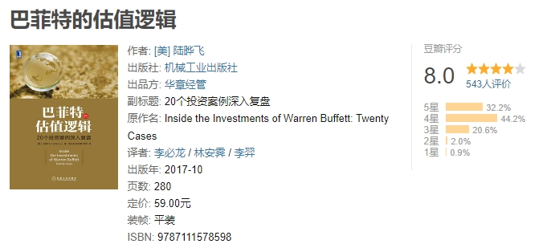



一句话总结：对行业定性的洞见，结合定量数据验证，管理层的深刻洞察，再加上足够的安全边际。

## 1、信息的质量：

对行业的定性分析，信息主要是根据企业的年报、行业的数据。巴菲特特别喜欢阅读，和行业的人交流，专注在1、2个行业不断加深洞见。如果没有高质量的信息支持你的定性见识，那么最好的选择就是不要投相关的标的。也就是我们要尽量保持我们的投资在我们的能力圈范围内。

## 2、利润增长的持续性

通过对公司未来前景的可靠预测的定性分析前提下，我们要通过定量分析去验证。最看重收入和利润的可持续性:

① 考虑了维护性的资本支出后的现金利润（一般是从现金流量表的经营净利润获得）

② 已用有形资金收益率（净利润/已用资金总额或者已用边际资本，这里的边际资本指的规模化后需要投入的资本会减少）。

第一个指标说明企业的价值，第二个指标说明企业是否是一个“复利机器“，因为资金收益率很高说明企业创造的收益率远远超过它的资金成本，意味着经营效率很高或者具有特许经营价值，也意味着只需要投入非常少的额外资金发展业务，用多数现金回馈股东或者从事收购。

除了这两个指标，还有一个最重要的需要验证就是未来是否能持续增长！

因为投资就是投未来的预期。也就是我们定性分析的必要性。巴菲特投资的公司基本有持续稳定的利润和收入增长，通过历史的财报数据（最好要10年以上，企业某一年份的增长并不能说明问题。）来验证企业增长的能力。

## 3、管理层的深刻洞察

一切企业经营决策离不开人的因素。

巴菲特评估管理层标准：

① 一次成功的企业经营经历。成功的企业经营经历说明管理者具备平衡收益（增长）和资产（风险）的能力。

② 特别看重老板型的经理人。要不是老板，要不是工作多年的内部晋升上来的。

③ 诚信

④ 有能力合理配置资金

## 4、安全边际

巴菲特有三种投资类型：

① 长期投资（这种标的一般是和市场相关联的，因为是企业价值被低估所以有较大的安全边际，但是时间不确定，只能坐等，长期看总能获利）

② 套利型（主要是清算、兼并，对市场依赖性小，能跑赢下跌的市场但是跑不赢强劲上涨的市场，一般时间确定性高）

③ 控股型（通过占大比例的股份，对企业经营方向施加影响，一般是非上市公司）

①这种方式，始终坚持最低的资本收益率标准来投资一流的企业。

## 案例分析：

### 1、控股型： 巴菲特通过控股这家公司，然后通过对公司的业务施加影响，但是不会介入公司的具体经营，获得收益。

①桑伯恩地图公司

这家公司主要是做城市建筑地图绘制。这个业务的特点是：绘制初始投入会很高，但是后期的投入会很少。也就是竞争者如果要进入这个市场，初始的投入成本会很高，并且需要和桑伯恩地图公司分享顾客，并且短期无法收回资金投入。一旦绘制地图后，后期的成本很低，也就是它的利润率会很高。

桑伯恩地图保持了十几年的主宰地位，后期的时候仍然盈利，但是净利每年都下降10%，但是公司有价值700万美元的股票和债券组合明显高于公司估值，同时每年可以带来10万美元的经营利润和20万美元的投资收益。

② 登普斯特农具机械制造公司

这是一家做风车灌溉系统机械的公司。

现金、存货、应收账款和其他流动资产可以在12-24个月变现，还掉负债，然后取2/3余额，仍然超过市价总值。 也就是说这是一家交易价格低于资产价值的企业。

巴菲特以保守估值的20%折扣购买，有较大的安全边际。

### 2、并购套利

计算年化收益率确保具有合理的收益率

① 得州国民石油公司

这家公司即将被收购，巴菲特买了这家公司的债券、普通股和可购买普通股的权证。收购成功，投资者能从债券、普通股等获得确定性的收益。

### 3、长期投资：为了一流优质企业可以付一个公允的价值

① 美国运通

这是一家提供旅行支票、汇票等金融服务的公司。在色拉油事件中，运通面临6000万美元的赔偿。股价从60美元跌到35美元。

过去9年，运通的收入年复合增长率是12%，净利润的年复合增长率是10%。当时财年结束，它是16%的经营利润率和11%的净利润率，相当不错的盈利能力。

现金：2.67亿

投资证券：4.44亿

政府债券：3500万（为客户保管，因为负债有一个对应科目）

贷款：1.72亿

应收账款：5200万

固定资产（土地、建筑和设备）：1400万

--

总资产：10.2亿

旅行支票：4.7亿

客户存款：3.66亿

对冲负债：3500万

--

负债总计：9.42亿

股东权益=总资产-总负债：7800万，资产总额超过股东权益10倍多。客户存款和旅行支票，总计8.36亿可以用来投资获得收益。

计算一下资金收益率=所有者利润（扣除了维护性资本支出的现金利润，这个一般是从现金流量表获得，当时还没有）/已用资金（未计商誉的有形资金和无形资金总额+运营资金净额）。78%（=7800万/10.2亿）资金收益率。

巴菲特购买的时候是以16倍市盈率: (40*446股）/1100净利润。企业价值（EV）/息税前利润(EBIT)大概是8倍。企业价值（EV）=总市值+长短期负债+租赁负债-现金以及现金等价物（现金流量表里找）。这个价格不便宜，但是巴菲特为什么还是买了？色拉油事件大概要支付4000万的现金负债，目前有现金2.67亿所以这边负债有能力偿还。但是这比债务意味着更高的成本，每股成本增加：4000/446股，这样会变成20倍市盈率。也就是你以16倍市盈率购买，但是实际上相当于20倍市盈率。当然企业价值倍数也变大了。

但同时要考虑这家公司的浮存金价值，4.7亿的旅行支票，偿付期为2个月，可以计算得到（4.7/12）*2=8000万的连续浮存金，假设这笔投资回报5%，则一年可以产生400万美元的收益。
