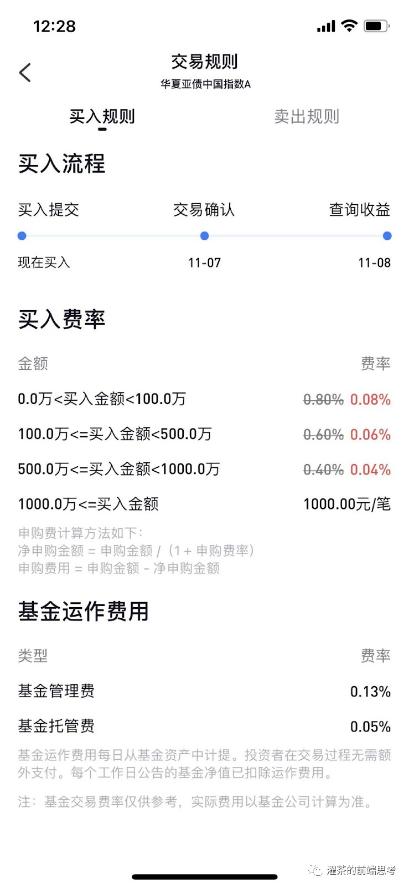



向大家分享下我最近学到的东西，主要聊下投资基金，债券，多元投资的想法，基金的选择。

大部分人可以说99%的人选择个股，都是跟随大流或者盲目的。要想要通过个股的选择获得收益超过指数是非常难的。

实际上我看的好几本书中列举的统计数据，大部分的高手甚至是主动型基金，都是幸存者偏差，短期可能赢，并不代表能一直赢，我们无法判断哪个高手或者哪个主动型基金。

一般人要判断价格低于内在价值的一流企业，基本做不到，也没有那个时间。所以适用于普通人的方法就是投指数。

所以，买指数是最佳选择。也许你会问：这么简单吗？不，其实没那么简单。

我研究了一段时间，结论是：不仅仅买指数，还需要股债组合，还要多元化资产配置，动态平衡。

看着很麻烦，其实也比较简单。

先说下为什么。

购买股票的时候，你需要决策价格是否便宜，一般会估值，然后和债券的无风险收益率比较，如果价格能抵消风险，大概率未来价值能回归。要能面对波动，要会估值。

所以债券是投资对标物。另外，和股票是相反的，如果股票涨，债券可能是跌，债券跌，股票可能涨。所以这两者是对冲关系。

长期看，股票收益远大于债券，但是当整个股市行情不好的时候(这个时间也许是几十年），你需要购买债券对冲，甚至当通货膨涨时，美国市场你需要购买跟踪通货膨胀的债券对冲风险。

那么，这两者比例一般是按照什么规则？按照你的年龄，比如你是30岁，可以按照2/8的比例，2是债券，随着年龄增长，债券的比例应该增加。也就是资产配置的比例不是确定的，根据个人的风险承担能力。

通过动态平衡是为了什么？每年年底或者年中操作一次，比如债券总体价值低于20%，股票大涨，则将股票部分卖出，购买债券。将比例回归到原先设定的，能通过低买高卖获得更高的收益。

这里我们主要谈指数（当然指数也可以替换为部分股票，前提是你有这个能力判断，当然这个比例最好根据我之前的分配，将大头分分给美国股票>发达>新兴市场，因为根据书籍中数据统计，美国股票收益是更大的）。

假定普通人就买指数。买什么呢？

购买单个个股的时候，我们需要支付佣金，如果是冲着分红去的，你也许不知道，股权登记日买进，然后分红后卖出，是要扣除一部分分红的。持股时间一个月内（含一个月），补缴红利金额的20%；持股时间一月以上，一年以内（含一年）补缴红利金额的10%；持股时间超过一年的，免税。

买基金的坑更多。

现在基金种类很多，什么LOF， ETF， 联接，等等，反正名目众多，即便是一个基金类型，指数基金，也有好几个基金公司。比如南方沪深300，沪深300ETF，这里又有场内和场外。

选择基金，我们确定指数基金是最便宜的，靠谱的，长期看能通过低换手率，低费率跑赢其他的所有主动型基金，包括高手。

场内的交易基本都比场外的交易费用低。

我对比了南方沪深300，沪深300ETF这两个，场内就是交易费用（券商佣金），还有托管费和管理费都一样的，场外看你买啥类型，比如南方沪深300A，这里的A就是说是购买的时候要收费（前端要收费）

比如我在场内买卖ETF指数基金的佣金是0.015%（万1.5），也就是说，我买 10 万元的基金，费用只需要 15 元。再卖出的时候，也需要 15 元。而场外投资相同金额，最少也要100的申购费。整体算下来，场内基金比场外费用可以省70%多。

比如，我看了雪球和同花顺基金的华夏亚债指数A收费情况：

对比了下支付宝，还要收一个客户维护费，不知道是干嘛的。。。当然有时候支付宝也可能做活动，打折。当然还有天天基金，没时间去看。所以场外一定要看清楚是否有赎回费甚至销售管理费。然后我看了基金官方网站，费用更高! 所以渠道很重要。

这个费用差距可能会让你的收益损失几十万。

再谈下美股购买。我用的富途牛牛，它的交易佣金为每股0.0049美元，最低交易佣金为1美元。除了交易佣金外，富途牛牛还会收取一定的清算费。清算费是交易所和结算所收取的费用，用于结算交易和保障交易的安全。在富途牛牛的美股交易中，清算费为每笔交易的0.0000221美元。

另外还有一个税的问题。你看很多理财书籍都会强调免税账户。我研究了下，富途交易的里面，你找下账户，会有一个w-8be表格，这个东西需要隔几年就要签署下，用来免税的，如果没有签署，购买股票税率奇高！

投资者在进行美股开户时，如果没有填写W-8BEN表格的话，可能会对针对来自美国的收入需要扣除30%的税款，而且这项税率远远高于其他与美国有税务协议国家的居民的税率。所以在投资者进行美股开户时，需要填报W-8BEN表格来证明自己并不是美国公民，需要免除于美国相关的税款。

讲完收费的重要性，最后重点讲下分散投资，也就是指数的选择。结合我最近看好几本书，翻阅各种资料。

中国市场选择：沪深300ETF、华夏亚债中国指数。

都是指数基金，低收费。华夏亚债中国指数A(F001021)  成立时间超过10年，10年年化3.75%，收益在中位数，中规中矩，跟踪的指数是中证国债及政策性金融债指数。

美国市场选择：TIP（通胀债券指数）、BND（总债券市场）、VTI（整体股市指数）

当然还有VT（全球股市指数），VT波动可能比VTI还要高，因为是全球的，所以VT和VTI我选择VTI。都是先锋基金或者IShares，费率极低。

如果按照懒人投资组合，债券指数和股市指数按照比例分配，并且每年动态平衡，是个人的投资致胜之道！如果你比较厉害，可以按照比例分配各个市场（发达、新兴市场、美国、房地产按比例分配投资）。

一个人，最重要的四件事：健康、财务、关系、情感和人生意义。财务必不可少。一个人的能力是平衡，平衡资产和产出。如果产出过多，资产被消耗殆尽，产出过少，资产浪费。

你的认知决定你的行动，你行动决定了你的结果。行动起来，做负责任的事情，迈向幸福和充实的人生。

信息来源：

- 《非凡的成功 - 个人投资的致胜之道》  
- 《财务自由之路》  
- 《拿工薪-三十几岁你而能赚够600万》  
- 雪球
- ChatGPT
- 谷歌