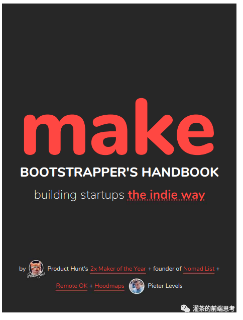

我对投资、创业产品等财增长思维比较关注，之前一直关注着Twitter大V levelsio。
图片他是一名很厉害的自由创业者，能独立运作很多产品，商业能力和产品能力都非常出众。这不他最近写了一本书《make bootstrappers handbook》，在线链接readmake.com。


因为非常佩服他的行动力和持续Make的能力，就看了这本书，读完后的确有一些收获（光读书没啥用，还是要行动起来图片），分享给大家。


这本书内容比较多，我看的版本缺少了一些内容，但是大致的目录纲领看，如何开始、实践以及一些工具的介绍，对我来说，是一个好的查阅手册。



## 核心收获 

### 想法验证

收集你自己的想法，从自己遇到的问题出发，一定要足够小可执行，对很多想法进行排序，按照你最想做的排。

如果没有想法怎么办？积极体验不同的事物来自己具备原创性。积极分享你的想法，不要怕想法剽窃，关键是行动力。

从微利基市场到多利基市场，从垂直到平台。不要一开始就想搞一个大的。

工具：

Zapier：设计工具  
Typeform：表单工具   
WordPress：建站  
MailChimp：营销、自动化和电子邮件平台  
Google Analytics  
MixPanel：产品分析  
Amplitude: 产品分析  
Hotjar: 产品分析  
AWS Simple Email（SES 不一定会被当做垃圾邮件，需要设置正确）/ postmark/ SendGrid / Cloudflare works(免费发送邮件， MailChannels避免进入垃圾邮件）: 邮件发送服务    

## 构建

快速并且最小化。利用工具快速构建MVP验证你的想法，一定要降低构建成本。

不要痴迷于工具。

推荐Web优先，web和Native未来将会融合。云服务器比较价格便宜，大概5美元/分钟，比Native开发便宜很多。

通过组合API实现产品想法。

不需要办公场地，随时随地。不需要钱和投资反而可能是你的优势，因为你100%拥有你的产品。

工具：

Linode: 虚拟专用服务器  
Digital Ocean: 虚拟专用服务器  
Heroku: 平台即服务  
Ubuntu  
Nginx: 可以设置默认服务器  
JavaScript  
Olark：网站聊天工具  
twilio：网站聊天工具  
ClickUp: 项目管理  
Trello: 项目管理  
Stripe: 支付平台  
Intercom：人工智能客服  
 
## 启动

争取2周内启动，要修复你的应用程序的大部分错误（确保产品没有bug，新用户能立即了解其内容并开始使用。），添加电子邮箱，推送通知，要有分析和反馈。

从小利基市场开始，比如朋友，再逐步扩大。通过反馈不断发布，可以直接提交到线上，有问题直接解决，快速验证是关键。

如果你产品无法激励你继续前行，则放弃它。

其他获取反馈的渠道：

- 给记者发送邮件获取新闻报道（寻找记者的网站：https://submit.co/），确保简洁，不像是垃圾邮件。

```
Subject: Food delivery startup for pets

Hi Jody! I made a site that lets you subscribe to food delivery for your pet. Let me know if you need more info :) 


https://petsy.com
```

- 为每个平台编写个性化的发布产品介绍。
- 博客写作：文本的方式写作，不带功利性质。现代媒体发达，尽量利用现代媒体表达你自己，读博客的人变少了，但是仍然还有。比如Snapchat、Instagram、Twitter、Facebook、小红书等国内APP

利基平台:

Product Hunt：发现新产品和初创公司的热门平台。  
Hacker News：一个以技术和初创公司为重点的社区驱动网站。  
Reddit：浏览与您的产品或行业相关的子论坛。   
Indie Hackers：独立制作者和企业家的社区。 
BetaList：发现和展示新创业公司的平台。  
Crunchbase：为您的创业公司创建档案并分享更新。  
GrowthHackers：专注于增长黑客和营销的社区。  
Designer News：适用于设计或用户体验重点的产品。  
PHLOUNGE：用于网络交流的Product Hunt的官方Slack社区。  
Stack Overflow：如果您的产品以开发为重点，请参与相关的问答活动。  
Quora：参与与您的产品领域相关的讨论。  
TechCrunch：提交您的产品以获取潜在的报道。  
AngelList：与投资者建立联系并展示您的创业公司。  
LinkedIn：与您的专业网络分享更新。  
Twitter：利用您的网络和相关的标签。  
Dev.to：与开发者社区互动。  
DN.Buzz：用于分享和发现独立产品的社区。  
AlternativeTo：将您的产品列为现有解决方案的替代品。  
Startup Stash：提交您的创业公司以在其目录中展示。  
Betalist：在其电子邮件通讯中推广您的产品。  
SaaS Invaders：面向SaaS产品的社区。  
Lobsters：一个技术为主的链接聚合站点。  
SlideShare：分享关于您的产品或行业的演示文稿。  
YouTube：制作演示视频或教程并在您的频道上分享。  
Medium：撰写关于您的产品或行业的文章。  
Dribbble：展示您产品相关的设计方面。  
Discord：加入相关社区并分享您的产品。  
Substack：创建一个通讯，分享更新和见解。  
Capterra：一个软件评论和发现平台。  
 
## 增长
 
不断更新发布，讲故事，公开构建，并且能让人们轻松分享（易读的url和slugs）。可以和用户一起构建，创造API，找到优于竞争对手的优势。  

## 货币化
 
收钱就是验证，不要害怕收钱。构建时就要考虑盈利。按功能付费，或者广告、赞助、订阅模式、社区模式、有条件的付款。  

订阅比单次付费好，即便考虑取消订阅的情况。什么东西可以订阅：一项服务，一个论坛，一个聊天群，针对特定利基市场的社交网络。当然，最好也提供终身制，就是客户的终身价值（LTV）大概是多少 x 平均使用时间, 计算出一次性支付金额。人们不再喜欢为内容付费，但是更喜欢为连接付费。订阅付费特别适合建立社区的商业模式，社区可以是讨论区、论坛、聊天组、社交网络到实体聚会。

包括使用Typeform快速充值，如何退款和记账以及税务问题。国内公司接入在线支付不需要办理ICP许可(除非牵涉第三方入驻）

工具：

Stripe  
Braintree  
Paypal  
本地化的支付工具  
Stripe Atlas  
平台组合  

##　自动化　

机器人其实就是脚本：要能比人工时间更少。比如给自己的机器人发邮件，自动执行一项任务。如果不值得自动化就不自动。

工具：

https://cronitor.io 监控任务是否实际运行　　
UptimeRobot.com 检查产品是否线上故障　　
Linode 云服务商　　
Namecheap 域名提供商。预付金额，确保不依赖信用卡，保持产品稳定。　　
雇佣朋友　　
telegram bot: telegram 大概有10亿用户 取代邮件通知（邮件的点击率比较低12000/150万 33%打开率？或者用浏览器通知可以覆盖桌面和移动设备ios）　　
https://www.simpleanalytics.com/： 网站统计　　  
  
## 注册公司
 
当你的用户达到一定规模可以考虑注册公司，当然也可以申请个体工商户（功能有限，无限责任）。 虽然前期付出注册公司的成本，但好处是：

- 申请各种第三方服务方便（支付等）  
- 可以接一些其他的服务开发票方便，税率低。（课程/咨询/广告）  
- 各种云服务平台针对企业认证会有各种的优惠。  

注册公司费用对比：  

成立海外公司：

https://stripe.com/en-jp/atlas 一次性设置费用500美元 + 100美元注册代理人每年

内地公司：

财务费大概300一个月，代做账、交社保之类杂事（低的有200一个月，考虑税务风险）+ 1500年审；财务代理公司2千以内，一年代理注册公司/代理记账等6k左右。

香港公司：大概财务费5200一年，+ 1500年审。  
国内注册公司：最好的注册方式就是咨询你周边的创业园区，都会有配套的服务，费用更低。地址挂产业园。现在不支持个体独资（不用给自己交社保），是小规模纳税。  