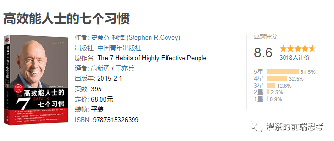

近些年一直看到认知这个词，但是我仍然不太清楚认知能给我带来什么，仅仅是鸡汤么？最近我有一点明白，虽然不是那么明白，但也逐渐开始清晰。

认知本质就是你的看待事物方式。每个人都有自己的思维模式，比如芒格的多维格栅模型，从不同视角看，你看到的世界和其他人是不一样的。所以这点很神奇，你是独一无二的你，没有人能替代你。时间空间被你独自占有，所以世界从这点来看是公平的。

认知就是要重塑你的大脑，张朝阳说，每个人的大脑都是可以被重塑的，我也相信。我不相信命运论，坚信自我暗示和刻意练习，后面我也想要学习大脑神经的知识，看下如何提高自我重塑能力。

段永平说，你的一生当中的所有决策会让你成为最后的你，那个“本该成为的人”，实际上是一道概率题。这句话，我理解就是投资的认知，本质上就是概率题。塔勒布说世界上本质就是不确定性的，黑天鹅随时存在，如何在不确定中获益不就是一个概率问题么。从《非凡的成功》到《漫步华尔街》都推荐稳健型的指数投资，简单的道理可能才是大道，在随机漫步的股票市场获得最终的成功。

创业的认知是什么？从财务自由角度（当然还有其他意义，就是你自身的价值，也就是自我的认知。）讲是为了获取主动收入，除了被动收入下的指数投资，你能做的事情就是主动收入。如何把创业这件事做成，每个人的认知是不一样的，比如理想汽车的CEO李想，他觉得CEO专注的是行业优势+行业问题+进攻方向，但是雷军或者乔布斯，甚至是阿里的CEO可能都不一样，也许本质是一样的。对于个人独立创业者，可能是如何低成本创业投资日记 #8期: 程序员的极简创业法则，或者是我上一篇分享的如何开始创建产品那样的创业思路。你看不同人和环境，看待事物的方式是不一样的，这就是认知。关键还是要抓住自己的认知机会，做成你自己的事。

说了一大堆，我觉得最终还是要回到自身，对自我的认知是最重要的，然后才是对周围环境的认知。最近看的一本书<高效能人士的7个习惯>，再结合之前看的一本书《从总监到总账》有点收获。以前一直拿不起这本书，先入为主的概念以为是一本鸡汤文，没什么软用。但实际上不是，每次输入都是会有收获的，会给你带来改变，生活中的很多答案都可以从书中找到。

这本书从两个视角，一个是个体的成功，一个是公众的成功。个体的成功从三个习惯出发，积极主动讲个人的选择，以终为始讲自我领导， 要事第一讲自我管理。公众的成功从双赢思维、解彼知己、统合综效。最后一个习惯是不断自我更新。

## 个体的成功

积极主动代表的是一个原则，就是行动和承诺。你可以选择好的一面，也可以选择坏的消极的一面。积极主动是基本的原则。

表达爱不是一个感觉，而是主动付出，你付出的越多你的情感账户储蓄（信任）越多。你有责任的同时意味着你有权力。产出和产能做好平衡。积极主动意味着你专注在你的影响圈，而不是关注圈，不轻易承诺，一旦承诺一定会尽力做到。

如何让自己行动起来。很多人内向，实际上有三个因素，1是缺少一个支持你的导师，导师的力量是支持你走出去的关键，能引导你，2是你的准备不充分，就像和别人沟通一样，你的信息储备不足、思考方案不充分，必然没有勇气，3是你没有刻意练习，比如投资日记 #7期:  职场进阶重要的三个模型 提到的在职场visibility的技巧，在演讲前先快速过一下大纲，在家里可以跟亲属练习或者镜子练习。最重要的，你的动机是什么？当你想明白你的目标，也就是以终为始，你的勇气又多加了几分。

以终为始的习惯，代表的是使命。每个人在社会上都有角色，也有使命或责任，即便你没有任何梦想，你也有责任，有责任意味着你必然有使命。你的使命是什么？你的价值在哪里?

首先你要发现自己的优势。

你要发现最喜欢的事情是什么，可以通过三个问题大概能定位出来。你喜欢做什么？这件事就是你空闲时间喜欢做的，关键是要开心的事情，比如运动、写作。哪些事你比较擅长？比如你沟通，运动，音乐等等，也就是你比身边的人做的更好的方面。哪个环境你最自在？喜欢独自工作还是协作，喜欢舒适还是创造性的环境。可以问下自己，假如今天财务自由了，我仍然喜欢做的事是什么？当然你可以通过一些测试，比如盖洛普优势测试。

当你知道自己的优势后，你才可能接纳自己，认同自己。巴菲特说一个人应该更多关注内部积分卡，也就是你做的事对你来说是正向的，而不是来自外部的评价。芒格也说，嫉妒和妄自菲薄毫无意义。都是想要表达一个人幸福的关键因子，就是从内出发，找到自己。

当你内在认同后，你才可能成为真实的自己。

假定你建立的使命是：成为一个对家庭有责任感的人，工作上或者事业有目标的人，对社会有一定影响力的人。你会对自己有要求，你会考虑自己的角色，比如丈夫、儿子等等。你生活的重心可能会偏向家庭、金钱、权力等，这本书告诉我们，要学会以原则为中心，用你的智慧正确处事，能否以智慧处之，需要有习惯三和习惯四、五、六的帮助。

一个人小时候的影响是巨大的，我从《亲密关系》这本书看到大部人的不合理行为都和小时候相关。而一个人的目标或者自我认同也和自己的经历分不开。要挖掘自己内心深处的感知，冥想是一个好方式。

要事第一讲的自我管理。包括注意力管理、目标管理、时间管理。关注第二象限的事重要而不紧急，而非让事情变成第一象限紧急而重要。要学会说“不”。从指令型授权变成责任型授权，明确预期成果、指导方针（原则和方向、可能出现的障碍和难题、行为限度）、可用资源（人力、财力、技术、组织资源）、任务考核（业绩标准和时间）、明确奖惩（结果好还是不好）。

## 公众的成功

公众的成功离不开人际关系，人际关系的本质是情感账户储蓄，包含礼貌、诚实、仁慈与信用。从这几个方面出发：理解他人、信守承诺、明确期望（期望不要含蓄）、正直诚信（不诋毁他人）、勇于致歉、无条件的爱。

问题的反面是契机，是建立情感账户储蓄的机会。

人际交往有六种模式，双赢、赢输、输赢、无交易、赢（我赢）、双输。习惯四是双赢思维。大部分人都是因为学习上都是竞争关系，带到社会上也大都以竞争关系为要，但是双赢才是取得成功的核心。当然我输你赢也不符合积极主动的原则。

双赢思维的五个要领是：品德、关系、协议、体系、过程。

品德就是你首先是诚信之人，其次你要成熟。（第一次看到成熟的定义：表达自己情感和信念的同时又能体谅他人想法和感受的能力，简单说就是敢做敢为同时善解人意），第三是知足，也就是相信蛋糕足够大的。

关系的意思就是我们之间是有情感账户储蓄的。不然肯定不跟你合作，我们之间没有信任。

在前面两个基础之上，才可能建立双赢的协议。也就是明确预期成果、指导方针（原则和方向、可能出现的障碍和难题、行为限度）、可用资源（人力、财力、技术、组织资源）、任务考核（业绩标准和时间）、明确奖惩（结果好还是不好）。

双赢要真正发生需要有体系保障。如果一个企业他提倡双赢，但是他的组织却是奖罚赢输的模式（也就是市面上末尾淘汰这种）肯定是不行的。

双赢过程指的是要知彼解己，真正理解对方的想法、需要和顾虑，而不是从立场出发，最后找到大家都能接受的解决方案和结果。

上面双赢过程讲到了知彼解己，也就是习惯五，核心要表达的就是要做有效沟通。要分清楚情绪性反应和理性反应。情绪性反应，可以从对方视角表达理解，但是不一样是认同，等他理性地想要讨论的时候，你才真正能发现对方的问题是什么。

最后从多个方案中找到最优方案，拿到最终的结果，就是习惯六要表达的统合综效，简单说就是求同存异，尊重差异，但是仍然能看到对方的优点，最终实现团体的目标。

## 不断更新

人最大的能力是创造的能力，而不是经济独立，这才是最大的内在安全感或者是自我认同  自我更新主要是从四个方面：身体、智力、精神、社会/情感。

身体属于第二象限，属于重要而不紧急。但是一旦变差就变成重要而紧急，所以要提前预防。身体训练从几个方面出发：耐力（心脏的脉搏跳动应该要达到：220-年龄，结果乘以0.6，才有训练效应）、韧性、力量（肌肉要有纤维断裂才有训练效果）。

智力层面: 定期阅读文学巨著、哈佛经典、名人传记、《国家地理》之类的，不断写作思考等等。

精神层面指的就是自我认同，你的使命是什么，价值是什么。

社会/情感主要就是如何处理人际关系方面的，也就是习惯五和六的练习。

