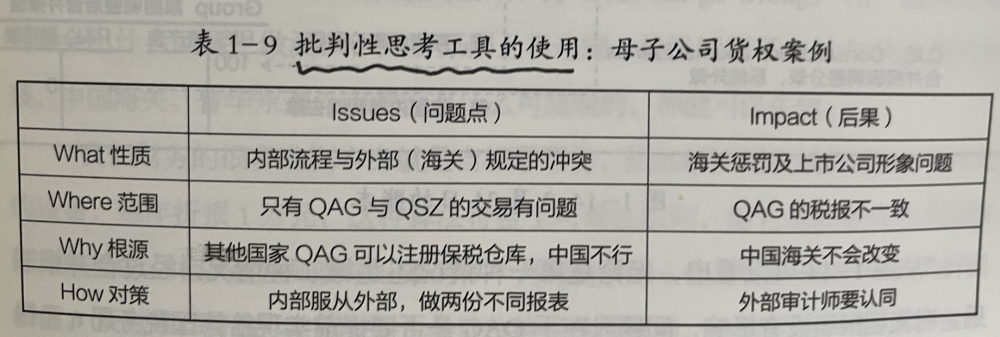



⚡️ Hi， 我是毛训星，欢迎打开新一期的「毛训星的投资日记 」，为您带来编程资讯、好书阅读和投资分享。

首先回答上一期的问题： 宏观经济模型能用来作为投资建议么？国内的通缩带来的影响是什么？

宏观经济模型对于普通人投资实际用处不大。但是对于公司财务CFO级别的可能有用，比如通过远期合同的方式锁定风险，实现无风险套利。

举个例子：
假设即期，5月3日1美元兑换6.493人民币，在5月3日这一天得到的银行6个月远期购汇报价是6.414，也就是11月以6.414元人民币买1美元的交割价。

5月3日假定本来我需要100美元支付给A。 可以这么操作：
1. 100美元结汇换成649.3人民币，然后这笔钱做存款质押6个月年化利率3.05%
2. 用这比存款质押，贷 **$100** 6个月利息4.43%（6个月后要连本带利要还$102.22，这里的贷财务的概念就是借），然后这笔钱给A
3. 签远期合同以6.414汇率购买102.22美元（锁定6个月后的汇率6.414）

11月3日到期后，你算一笔账：
1. 汇率差收益： $100*(6.493-6.414)=¥7.94，
2. 利息差损失： $100*6.414*4.43%/2 - $100*6.493*3.05%/2（因为是6个月，所以要除以2）=¥4.31。
3. 整体净收益：7.94-4.31=3.63

这个就是上一期宏观经济学7大模型的第三大模型「套利模型」的金融套利使用。当然这里的借款可能会反映在当期财务报表上，影响投资者。

第二个问题： 国内的通缩带来的影响是什么？通缩表现出来就是物价水平下跌，CPI本国跌。实际上我们看现在的银行利率是在往下跌的，根据第六个模型：「可贷款市场和外汇市场关系模型」，利率下跌，汇率会上升，人民币升值。这么做的好处是促进国外投资，因为根据套利模型，人民币升值会增加套利机会。

## 本周编程

> 持续关注前端资讯，最新技术

一. 前端资讯：
+ [Better Images in Astro](https://astro.build/blog/images/): 底层默认支持了更好的体验
+ [Introducing Vercel's AI Accelerator](https://vercel.com/blog/vercel-ai-accelerator):Vercel下一步大棋，推出面向开发人员的 AI SDK 和加速器
+ [Fresh 1.4 – Faster Page Loads, Layouts and More ]: 推出1.4版本，带来更多特性
+ [Meet Studio: Our beautiful new agency site template](https://tailwindcss.com/blog/2023-08-07-meet-studio-our-new-agency-template): 推出一款默认的站点模版
+ [React Live Conference](https://reactlive.nl/): 欧洲的React在线会议
+ [Dev Mode fast follows: 200+ new features and fixes](https://www.figma.com/blog/dev-mode-fast-follows-200-new-features-and-fixes/): Figma的一系列新特性介绍

二. 深度文章：

+ [What is PNPM & Why You Should Try It As a Frontend Developer](https://javascript.plainenglish.io/what-is-pnpm-why-you-should-try-it-as-a-frontend-developer-8dc3853c1ba1): pnpm是最佳实践
+ [Build a Cross-Platform CLI with Deno in 5 minutes](https://deno.com/blog/build-cross-platform-cli): deno跨平台cli工具
+ [Running up that hill: Creativity, AI, and the human pursuit of uphill thinking
](https://www.figma.com/blog/uphill-thinking/)：微软John Maeda 分享了他的《技术设计报告》中的要点、关于人工智能设计的想法
+ [More Lessons from Hackers: How IT Can Do Better](https://thenewstack.io/more-lessons-from-hackers-how-it-can-do-better/)：关于工程做的更好的建议
+ [Animating Page Scroll in CSS](https://medium.com/javascript-in-plain-english/animating-page-scroll-in-css-7a1047084dee)

## 本周阅读

> 持续分享好书带来的价值和思考

今天分享这本书，推荐指数五星：

一句话总结： 分享了有趣有料的以财务为原型，从职场小白升级到职场管理的故事。

不要被它的书名给误导了，这本书不仅仅讲财务，而且对于职场人来说也非常有价值。比如职场来说，提到了几个关键模型：

一、能力模型

1、 **快速成长最重要是有可视度** 其次是关系，能力。**可视度** 指在关键场合的机会，比如露脸演讲，表现出你足够的勇气、专业素养。其中能力的占比甚至不足20%。

关系是怎么来的？靠你在重要人物面前逐渐建立的信任感，当然这里就有你的能力发挥了重要作用。

能力是基础，能力扩展关系，关系换来机会，机会换来成长。能力达到一定高度才会启用你的管理才能，有先后顺序。

2、关注圈和影响圈：**列出影响圈清单**，把所有能量聚集在影响圈，专注带来的改变，影响圈会越来越大。

3、动态思维vs静态思维：相信是一种动态思维，怀疑是一种静态思维。相信促进改变，怀疑止步不前。

4、批判性思维工具分析问题

5、内化知识，要善于总结：要有关键讯息，其次是归类信息说明（借助表格/图表），数据。**分类是解决复杂问题的第一把钥匙**。建立知识库，错误归集。

6、拉动式学习 vs 推动式学习： 以学员为中心，让其选择课程。然后提供问题。当学完课程后，先自己解答，然后mentor看对方解答解答疑惑。最后才提供答案。

7、OCA模型，通过开放性思维给出可选项，以及可供选择的方案对比。

8、用好价值取向图。ATM作业价值模型梳理工作流程。

9、人才卡片：硬技术和软技能有哪些长板和短板，列出来。

10、能力评估九宫格：自我实现预言

11、汇报必须由外到里，以终为始，从轻到重。**切记以自我认知为起点，不考虑演讲对象和对象的感受**。 

数据-> 信息 -> 一句话讯息

最终呈现出来的最重要的是讯息，其次是信息说明，最后是数据。信息说明一般是图表结合文字，数据则是通过链接方式辅助说明，讯息放最重要位置。

5-7分钟必须抓住观众的注意力。

比如审视我这篇周报，有重要讯息，有结构化的信息，辅助信息的数据。

11、3R模型： 背诵、演练、唤醒。背下大纲，然后案例；其次演练；最后上场前预热。最好是准备一些可能被问到的问题，如何回答。如果不会回答，怎么处理。

12、六顶思考帽来帮助全面思考：白色帽子站在客观的角度；红色帽子从感情出发；黑色帽子从缺点问题出发；黄色从优点出发；绿色从创新角度出发；蓝色从控制与组织角度出发。

13、**简单思维和数字思维的区别**： 简单思维事“要不要”和“能不能”，**数字思维是建模能力**。**从需要的信息也就是数字，到行为假设变成函数，得到模型** 

14、影响力模型： 扩大能力边界。好的影响力是具有专业价值的信息，坏的影响力是“噪音”

15、通用能力进阶图

16、卡诺价值模型

17、研讨会3O模型： Outcome大目标，Objective研讨会目标，Output研讨会输出也就是具体Action。

18、快思考VS慢思考： 挑战既定思维和预置假设。

二、关系模型

1、三种职业性格色彩：红、绿、蓝。红色的人目标驱动，给人压迫感，容易造成摩擦；绿色的人做事讲究合理性，不紧不慢，但过于关注细节而忽略目标；蓝色的人在意工作氛围，和人的关系，有人缘情商高，乐于分享。

2、性格色彩不是绝对的，薛定谔的猫的实验告诉我们，每个人都处于叠加态。

3、情感账户。每个人都有一个情感账户，平时要多往里存，EBA存款图： 比如准时参会，表达关切，主动提供专业帮助。关键时候提供提取。不要滥用子弹。评价和感受的区别，感受是具体而带有例子的，评价偏主观。

7、沟通次序的清单：最重要和关系最深的要第一个沟通。从肢体语言/眼神看支持力度，情绪。

8、离职吃饭是获取重要信息的渠道。

9、**做好反馈**：关注他人的**职场行为动机（VBI)**，比如有些人是社交乐趣；有些人是获得外界认可，外在驱动型人格；有些人是获得专业上的认可。那么可以从这些角度出发，营造氛围，《关键对话》这本书告诉我们的营造氛围的重要性，**慢就是快**，困难问题迎刃而解。然后， 抓住以下要点：要即时；要具体不要笼统；讲事不要讲人；换位思考先**倾听示弱**，尽量客观地表达一件事，而不是先入为主表达情绪，甚至带有攻击性。

10、下属跨级沟通注意尽量不要表达个人观点，避免被设局。

三、管理模型

1、平衡计分卡模型：衡量一个公司是否管理得好，绩效、客户满意度、内部流程、员工发展

2、杠杠思维：营运杠杆。从点到面，比如从单个店的经验到品牌或者技术的打包课程，通过授权加盟厂商，获得销售提成。资本杠杆：财务管理的专业能力。资源杠杆： 组织竞争力。

3、经理人三大基本技能：任务管理，反馈，时间管理。其中**任务管理要区分目标拆解**，目标拆解就是已经确定好方案，然后派任务，**任务管理是先要定义任务，必须有对先行指标做改变。** 通过鱼骨图从结果一步步深挖原因，找到先行指标。

4、如何推动影响利益方：高影响力人员，要从对方KPI考虑，让旁观者变成参与者，这就是共情能力

5、价值链合作共赢：合作方就像蜜蜂一样带来持续的价值，也汲取它的营养。关键是要互相分享经验。

6、留住人才的3M模型： 通过项目找到工作的意义（Meaning）；自主式学习获得成长（Menu），这里自主学习是指给方向，让它们自己去培养自己的孩子；导师指点迷津（Mentor)

7、时间管理： 四象限图。少做救火的事；多做建立关系，提高效能的事。**大石头优先原则**，通过每周计划日历上提前锁定资源，预测投入时间是否能保证。会议重要性排名。

## 本周投资

> 做一家小而美的公司

准备把这几本书看完：
+ 《The Psychology of Money》
+ 《就想做家小公司》
+ 《Traction: How Any Startup Can Achieve Explosive Customer Growth》
+ 《The minimalist entrepreneur》

## 关于我

本周工作忙+早上困，小册写作无进展，加油吧。

运动2/3次，每次40分钟，基本满足运动量。目前体重66.5KG(170cm）
