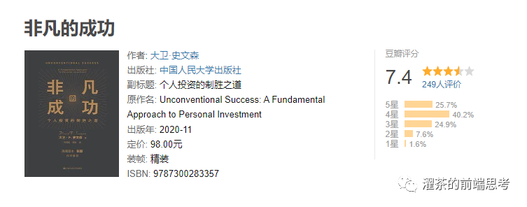

我摘取了《豆瓣》上的截图，总体网友评价还是不错的。说实话，这本书我第一次读的时候，觉得很不靠谱，写了一大堆，阅读的时候体感不是很强，对个人收益好像不那么明显，有一种看了好像没看的感觉

看网友的一些评论就知道，他们和我第一次看的时候，是同样的感受。这里面我觉得有两个原因一是里面概念比较多，因为是翻译过来的，所以总体上阅读会比较不那么顺畅，其次本书讲的实战经验较少

但实际上，这本书被严重低估了。因为最近构建自己的投资组合（当然我还参考了《漫步华尔街》这本书，这本书我准备再读一遍），我又重新读了一遍。这次我读的很慢，认真思考背后的逻辑。我觉得这本书是一本值得推荐的好书。

关于网友的评论，我有几点想说：

首先，没有100%的实战给你提供，因为每个人的认知不一样，我给你的不如你自己理解和认知的。就算给你了，你也不一定觉得对， 一个人不可能给另一个人认知。所以网友一开始看的时候，其实就是带着实践或者能立即告诉你宝藏的钥匙，耐心不足，这样是学不到东西的。

其次，财富积累大家都说长期？你真的明白什么才是长期吗？很多人没明白这个道理。复利有一个公式叫72原则，就是72除以你的利率要求，比如每年8%利率，大概9年能让你的资产翻倍。如果利率更大，比如12%，6年就可以让你的资产翻倍。本书的作者做到了17%的年回报率，也就是4-5年就翻倍了。是相当牛逼的。这里有两个变量就是时间+收益率。长期的意思就是正确对待各类资产的配置，能稳定安全的获得足够高的收益，在时间效用下获得成功。

其实大师已经告诉了你致胜之道，但是很多人没听懂。真正懂的人是少数，而懂的人要做到，又少之又少了。需要足够的知识还有勇气。

我觉得有几个比较重要的点，是我从这本书总结出来的。把一本书读薄，就是将知识内化，写作是最好的方式。

投资收益的来源是什么？简单就两个：一个是市场作用 一个是投机炒作。

你可以通过不同的资产配置、择时交易、证券选择来获取市场上的收益。这本书提到可信研究表明: 在投资收益率的变动中，大约90%是源于资产配置，10%由择时交易和证券选择。也就是资产配置在市场上起到决定性的作用。而投资配置要走到三个原则：1 侧重股票资产 2 多元化 3 考虑税负的影响

这几点，是符合常识的。但实际上做到的人很少很少。虽然热门股票或者择时交易是人们热衷谈论的，符合人性。实际上，投资收益是一件乏味和简单的事情，而这几个原则是最为重要的。

为什么偏重股票？

股票是一种剩余价值/权益的实现，就是说公司需要在偿还了债权人之后 ，才能给股东分配收益。也就是股东承担了更高的风险。它的投资收益比债券更高就是合理的了。

实际上，历史的统计数据也表明了这一点。过去美国78年，美国大公司股票的年化收益率是10.4%，而长期债券是5.4%，短期债券是3.7%。两者相差5个百分点。

即使是微不足道的收益率差异，如果长期看，会演变为惊人的财富悬殊。这就是复利的力量，就是要重视收益率。

所以，我应该把所有的“鸡蛋”都放到股票吗？非也。

历史上的股灾会让你损失惨重。历史上投资买的小盘股跌幅曾经达到过90%，仅一天股市可能暴跌20%， 虽然长期看，股票会涨回来，时间长的话，有一次21年才涨回来，凯恩斯有一句话说得好：”长期来看，我们都已经死了“。所以多元化是必须的。多元化，能让我们享受“免费的午餐”，保证收益率的前提下安全，偏重股票能让我们有积累更多财富的可能性。

那么?什么才是多元化。我以50%购买国内股票，国内债券和现金占比40%，是多元化吗？首先这里的债券和现金占比过高，不符合偏重股票的原则，其次这两者将近90%都会受到国内市场利率水平的影响，没有真正的多元化。投资国内有价证券的比例过高了。真正的多元化，投资国内的有价证券比例大概32%，其他都投资于其他多元化资产（比如房地产、发达/新兴国家，债券也分美债和通货膨胀指数债，因为短期内，股票无法对抗通货膨胀的风险。美国国债提供了对抗通缩的能力，通货膨胀保值债券为投资者提供了能够负担得起的通过膨胀保护措施。当其他类型的证券大幅下跌时，国债反而会出现上涨的趋势，债券：拥有政府的完全信用担保，而且政府发行债券凭证的数量非常庞大，具有不可回购、期限较长、无违约风险等优势。是投资组合实现多元化的最具威力的投资工具，能抵消财政危机和预料之外的通货紧缩带来的损失，但是如果通货膨胀时，会遭遇损失，所以只做适量配置。这里如果大家学过宏观经济应该比较好理解，当通货紧缩时，央行一般通过购买债券能提高流动性。债券和利率的关系是什么？当利率提高的时候，公司未来收益的贴现率也会提高，这会导致股价下跌。同理，债券价格也会下跌，也就是利率和债券是反向关系。政府和债券持有人具有利益一致性关系。因为如果政府让债券持有人受损，那么它将很难再进入信用市场）。

如何分配各类资产。70%的国内股票、国外股票和房地产等高预期的收益资产。还有统计性要求，就是单一资产所占比例不低于5%， 且不超过30%。

多元化是一种降低风险的措施，而不是追逐业绩的手段。所以，对自己制定的投资组合保持坚定的信心，即使短期内遭遇挫折，也不能轻易改弦易张，这种信心来自对投资组合的深刻理解，是对个人风险偏好的清晰认识下，与基本投资准则相互协调、共同作用的结果。简单说，就是要坚定持有多元化资产，并且严格定投，确保比例始终的合理性。

投机炒作是靠的短期波动，没有实现真正的资产价值，这里的资产主要是权益类资产，比如股票。而债券的作用更多是多元化的手段。

如何选择合理的ETF? 这个对于我们来说，很有挑战。追求结构良好、定价合理、并且要广泛投资6大核心资产的证券。对于市场上的ETF要保有谨慎和怀疑的态度。比如单一国家或者行业的基金或者投资组合长期不变，无法对指数变化做出反应。或者提供相同的服务，费用却大不同。

当我们实现多元化的组合时，如何实现再平衡。我们要考虑纳税的相关事项，比较好的方式是通过新增现金投入到比例低的资产类别，可以避免卖出时的费用支出。